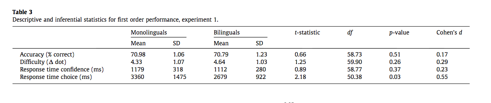
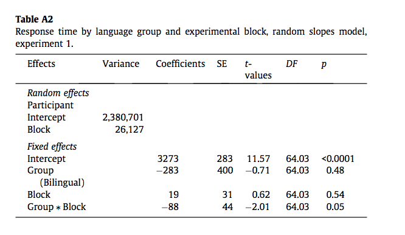
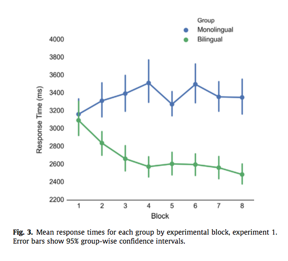

#### Article ID: DvcDF
#### Pilot: Sara Altman
#### Co-pilot: Maya Mathur  
#### Start date: Apr 7 2017
#### End date: Sep 22 2017 
#### Final verification: Tom Hardwicke
#### Date: Nov 9 2017

-------

#### Methods summary: 
The experimenters tested sixty-two participants. Half were monolingual and half were bilingual. The experimenters gave the participants working memory and non-verbal reasoning tasks to ensure that the bilingual and monolingual groups were similar in terms of cognitive functioning. Working memory was assessed using the Wechsler Adult Intelligence Scale IV. Non-verbal reasoning was assessed using the Raven's Advanced Progressive Matrices. The experimenters also checked the English language proficiency of the bilinguals. 

To measure metacognitive performance, the experimenters administered a dot discrimination task. In the dot discrimination task, participants were presented with two white circles on a black background. The participants were asked to choose which circle contained the most dots within its boundary. The differences in dot numbers were modified with a staircase procedure so that accuracy was normalised at 71%. Participants completed 8 blocks of the dot discrimination task, each with 25 trials. 

------

#### Target outcomes:

The experimenters conducted a t-test to compare the bilinguals' and monolinguals' choice response time in the dot discrimination task. 

> We compared the bilinguals’ and monolinguals’ performance with regard to their first order accuracy (measured by percentage of correct responses), the difficulty of the trials (measured by dot difference) and response time of the choice and the confidence judgment (both measured in seconds). The results of all these analyses are summarised in Table 3.
The monolingual group had a mean accuracy of 70.98%, with a standard deviation of 1.06%, whilst the bilingual group had mean accuracy of 70.79% with a standard deviation of 1.23%. This indi- cates that the staircase procedure successfully standardised accu- racy across participants. There were no significant group differences with regard to trial difficulty, with a mean dot differ- ence of 4.64 for the monolinguals and 4.34 for the bilinguals. Addi- tionally, with regards to response time for the confidence judgments there was no difference between the groups: the mono-lingual group took, on average, 1179 ms to respond compared to 1112 ms for the bilinguals.

> However, the groups did differ with regards to choice response time; an independent samples t-test showed that bilinguals (M = 2679 ms, SD = 923 ms) were significantly faster than mono- linguals (M = 3360 ms, SD = 1475 ms, t(50.38) =  2.18, p = .03, d = 0.55). A random slopes multilevel model (MLM) revealed that this relationship was significantly mediated by block (see Fig. 3; for more detailed information about the MLM fitting see Appendix A). Monolinguals were set to be the reference category for this analysis and all subsequent MLMs. The model tells us that the main-effect of group became statistically non-significant when the block-group interaction was accounted for (b = 283.11, t (64.03) = 0.71, p = 0.48). The main effect of block was also non- significant (b = 19.23, t(64.03) = 0.61, p = 0.54), meaning that the response speed of the monolinguals did not change significantly over time, when individual variation in intercepts and slopes were accounted for. The bilingual group ⁄ block interaction was signifi- cant (b =  88, t(64.03) =  2.01, p = .05), meaning that bilinguals, as a group, became faster as the task progressed.

> Two participants in the monolingual group displayed outlying values for one variable (difficulty and response time, respectively). In order to ensure that these outliers did not unduly influence the group-wise comparisons they were both capped at 3 standard deviations above the group mean. Capping these values did not change the results for difficulty (t(59.78) = 1.29, p = .20, d = 0.33) or for response time (t(55.17) = 2.24, p = .03, d = 0.57).

------

```{r global_options, include=FALSE}
knitr::opts_chunk$set(echo=TRUE, warning=FALSE, message=FALSE)

# prepare an empty report object, we will update this each time we run compareValues2()
reportObject <- data.frame("Article_ID" = NA, "valuesChecked" = 0, "eyeballs" = 0, "Total_df" = 0, "Total_p" = 0, "Total_mean" = 0, "Total_sd" = 0, "Total_se" = 0, "Total_ci" = 0, "Total_bf" = 0, "Total_t" = 0, "Total_F" = 0, "Total_es" = 0, "Total_median" = 0, "Total_irr" = 0, "Total_r" = 0, "Total_z" = 0, "Total_coeff" = 0, "Total_n" = 0, "Total_x2" = 0, "Total_other" = 0, "Insufficient_Information_Errors" = 0, "Decision_Errors" = 0, "Major_Numerical_Errors" = 0, "Minor_Numerical_Errors" = 0, "Major_df" = 0, "Major_p" = 0, "Major_mean" = 0, "Major_sd" = 0, "Major_se" = 0, "Major_ci" = 0, "Major_bf" = 0, "Major_t" = 0, "Major_F" = 0, "Major_es" = 0, "Major_median" = 0, "Major_irr" = 0, "Major_r" = 0, "Major_z" = 0, "Major_coeff" = 0, "Major_n" = 0, "Major_x2" = 0, "Major_other" = 0, "affectsConclusion" = NA, "error_typo" = 0, "error_specification" = 0, "error_analysis" = 0, "error_data" = 0, "error_unidentified" = 0, "Author_Assistance" = NA, "resolved_typo" = 0, "resolved_specification" = 0, "resolved_analysis" = 0, "resolved_data" = 0, "correctionSuggested" = NA, "correctionPublished" = NA)
```

## Step 1: Load packages

```{r}
library(tidyverse) # for data munging
library(knitr) # for kable table formating
library(haven) # import and export 'SPSS', 'Stata' and 'SAS' Files
library(readxl) # import excel files
library(CODreports) # custom report functions
library(readr)
library(lsr)
library(lme4)
library(lmerTest)  # for inference
library(stringr)
library(pbkrtest)

data_file <- "data/data.xlsx"

#new data files
full_data_file <- "From author (2017-7-28)/FullData_Exp1.csv"
part_data_file <- "From author (2017-7-28)/ParticipantData_Exp1.csv"
 
rename_all <- function(df, fun){ 
  setNames(df, fun(names(df))) 
  }
```

## Step 2: Load data

```{r}
column_names <- c("id", 
                  "group", 
                  "first_accuracy", 
                  "first_rt",
                  "first_dot_diff",
                  "second_confidence",
                  "second_mratio",
                  "mratio_1",
                  "mratio_2",
                  "rt_1",
                  "rt_2",
                  "rt_3",
                  "rt_4",
                  "rt_5",
                  "rt_6",
                  "rt_7",
                  "rt_8")


#I recalculated the average reaction times because the ones given were rounded                                                        
data <- read_excel(data_file, sheet = 2, skip = 2, col_names = column_names) %>% 
  mutate(first_rt = (rt_1 + rt_2 + rt_3 + rt_4 + rt_5 + rt_6 + rt_7 + rt_8)/8) 

demographics <- 
  read_excel(data_file, sheet = 1) %>% 
  rename_all(tolower) %>% 
  rename(id = `participant id`) %>% 
  filter(!is.na(id))
```


## Step 3: Tidy data

```{r}
# long format
data_tidy <-
  data %>% 
  group_by(id) %>% 
  gather(key = "measure", value = "value", first_accuracy:rt_8)
```

## Step 4: Run analysis

### Pre-processing

> Two participants in the monolingual group displayed outlying values for one variable (difficulty and response time, respectively). In order to ensure that these outliers did not unduly influence the group-wise comparisons they were both capped at 3 standard deviations above the group mean.

The following code chunk confirms that there are two participants in the monolingual group with outlying values for one variable (difficulty and response time).

```{r}
mean_diff = mean(data$first_dot_diff, na.rm = TRUE)
sd_diff = sd(data$first_dot_diff, na.rm = TRUE)
mean_rt = mean(data$first_rt, na.rm = TRUE)
sd_rt = sd(data$first_rt, na.rm = TRUE)

data_tidy %>% 
  spread(key = measure, value = value) %>% 
  filter(first_dot_diff > mean_diff + 3*sd_diff | first_rt > mean_rt + 3*sd_rt)
```

This code chunk caps the values as specified in the original paper and performs the t-test:

```{r}
data_tidy_capped <-
  data_tidy %>% 
  spread(key = measure, value = value) %>% 
  mutate(first_dot_diff = ifelse(first_dot_diff > mean_diff + 3*sd_diff, 
                                 mean_diff + 3*sd_diff, 
                                 first_dot_diff),
         first_rt = ifelse(first_rt > mean_rt + 3*sd_rt, 
                                 mean_rt + 3*sd_rt, 
                                 first_rt))

monolingual_capped <- 
  data_tidy_capped %>% 
  filter(group == "Monolingual")

bilingual_capped <- 
  data_tidy_capped %>% 
  filter(group == "Bilingual")
```

> Capping these values did not change the results for difficulty (t(59.78) = 1.29, p = .20, d = 0.33) or for response time (t(55.17) = 2.24, p = .03, d = 0.57).
 
```{r}
t_test_rt_capped <- t.test(x = monolingual_capped$first_rt, 
                           y = bilingual_capped$first_rt)
d_rt_capped <- cohensD(x = monolingual_capped$first_rt, 
                       y = bilingual_capped$first_rt)
t_test_diff_capped <- t.test(x = monolingual_capped$first_dot_diff, 
                             y = bilingual_capped$first_dot_diff)
d_diff_capped <- cohensD(x = monolingual_capped$first_dot_diff, 
                         y = bilingual_capped$first_dot_diff)

t_tests_capped <-
  tibble(
    measure = c("Response time", "Difficulty"),
    t = c(abs(t_test_rt_capped$statistic), abs(t_test_diff_capped$statistic)),
    df = c(t_test_rt_capped$parameter, t_test_diff_capped$parameter),
    p = c(t_test_rt_capped$p.value, t_test_diff_capped$p.value),
    d = c(d_rt_capped, d_diff_capped)
  )

kable(t_tests_capped, digits = 2)
```

The t-value for difficulty is slightly off. As are the degrees of freedom. The Cohen's d values are the same as originally reported, as are the p-values. 

Here we explcitly compare the values.

Reported t-value and the calculated t-values for response time:

```{r}
reportObject <- compareValues2(reportedValue = "55.17", obtainedValue = t_test_rt_capped$parameter, valueType = 'df')
reportObject <- compareValues2(reportedValue = "2.24", obtainedValue = t_test_rt_capped$statistic[[1]], valueType = 't')
reportObject <- compareValues2(reportedValue = ".03", obtainedValue = t_test_rt_capped$p.value, valueType = 'p')
reportObject <- compareValues2(reportedValue = "0.57", obtainedValue = d_rt_capped, valueType = 'es')
```

Then the reported and calculated t-values for difficulty:
> Capping these values did not change the results for difficulty (t(59.78) = 1.29, p = .20, d = 0.33) or for response time (t(55.17) = 2.24, p = .03, d = 0.57).

```{r}
reportObject <- compareValues2(reportedValue = "59.78", obtainedValue = t_test_diff_capped$parameter, valueType = 'df')
reportObject <- compareValues2(reportedValue = "1.29", obtainedValue = -t_test_diff_capped$statistic[[1]], valueType = 't')
reportObject <- compareValues2(reportedValue = ".20", obtainedValue = t_test_diff_capped$p.value, valueType = 'p')
reportObject <- compareValues2(reportedValue = "0.33", obtainedValue = d_diff_capped, valueType = 'es')
```

Some minor numerical errors.

### Descriptive statistics

Table 3 from the original paper provides descriptive statistics.

> there were no significant group differences with regard to trial difficulty, with a mean dot difference of 4.64 for the monolinguals and 4.34 for the bilinguals.

However, the table says the mean dot difference for monolinguals is 4.33, and the mean dot difference for bilinguals is 4.64.  



The following code chunk recreates this table:

```{r}
#Mean and sd accuracies for mono- and bilinguals
accuracy_tibble <-
  data_tidy %>% 
  filter(measure == "first_accuracy") %>% 
  group_by(group) %>% 
  summarise(mean_accuracy = mean(value*100, na.rm = TRUE),
            sd_accuracy = sd(value*100, na.rm = TRUE)) %>% 
  arrange(desc(group))

#difficulty mean and sd for mono- and bilinguals
dot_diff_tibble <-
  data_tidy %>% 
  filter(measure == "first_dot_diff") %>% 
  group_by(group) %>% 
  summarise(mean_dot_diff = mean(value, na.rm = TRUE),
            sd_dot_diff = sd(value, na.rm = TRUE)) %>% 
  arrange(desc(group))

#response time confidence mean and sd for mono- and bilinguals
confidence_tibble <-
  data_tidy %>% 
  filter(measure == "second_confidence") %>% 
  group_by(group) %>% 
  summarise(mean_confidence_rt = mean(value * 1000, na.rm = TRUE),
            sd_confidence_rt = sd(value * 1000, na.rm = TRUE)) %>% 
  arrange(desc(group))

#response time choice mean and sd for mono- and bilinguals
rt_tibble <- 
  data_tidy %>% 
  filter(measure == "first_rt") %>% 
  group_by(group) %>% 
  summarise(mean_choice_rt = mean(value*1000, na.rm = TRUE),
            sd_choice_rt = sd(value*1000, na.rm = TRUE)) %>% 
  arrange(desc(group))

#creates tibble of all values 
all_measures <-
  accuracy_tibble %>% 
  left_join(dot_diff_tibble, by = "group") %>% 
  left_join(confidence_tibble, by = "group") %>% 
  left_join(rt_tibble, by = "group")

monolingual <- 
  all_measures %>% 
  filter(group == "Monolingual")

bilingual <-
  all_measures %>% 
  filter(group == "Bilingual")

t_test_accuracy = t.test(x = data_tidy %>% 
                             filter(group == "Monolingual", measure == "first_accuracy") %>% 
                             .$value,
                         y = data_tidy %>% 
                             filter(group == "Bilingual", measure == "first_accuracy") %>% 
                             .$value)

t_test_difficulty = t.test(x = data_tidy %>% 
                             filter(group == "Monolingual", measure == "first_dot_diff") %>% 
                             .$value,
                         y = data_tidy %>% 
                             filter(group == "Bilingual", measure == "first_dot_diff") %>% 
                             .$value)

t_test_confidence = t.test(x = data_tidy %>% 
                             filter(group == "Monolingual", measure == "second_confidence") %>% 
                             .$value,
                         y = data_tidy %>% 
                             filter(group == "Bilingual", measure == "second_confidence") %>% 
                             .$value)

t_test_rt <- t.test(x = data_tidy %>% 
                      filter(group == "Monolingual", measure == "first_rt") %>% 
                      .$value, 
                    y = data_tidy %>% 
                      filter(group == "Bilingual", measure == "first_rt") %>% 
                      .$value)

cohens_d_accuracy = cohensD(x = data_tidy %>% 
                             filter(group == "Monolingual", measure == "first_accuracy") %>% 
                             .$value,
                         y = data_tidy %>% 
                             filter(group == "Bilingual", measure == "first_accuracy") %>% 
                             .$value)

cohens_d_difficulty = cohensD(x = data_tidy %>% 
                             filter(group == "Monolingual", measure == "first_dot_diff") %>% 
                             .$value,
                         y = data_tidy %>% 
                             filter(group == "Bilingual", measure == "first_dot_diff") %>% 
                             .$value)

cohens_d_confidence = cohensD(x = data_tidy %>% 
                             filter(group == "Monolingual", measure == "second_confidence") %>% 
                             .$value,
                         y = data_tidy %>% 
                             filter(group == "Bilingual", measure == "second_confidence") %>% 
                             .$value)

cohens_d_rt <- cohensD(x = data_tidy %>% 
                         filter(group == "Monolingual", measure == "first_rt") %>% 
                         .$value, 
                       y = data_tidy %>% 
                         filter(group == "Bilingual", measure == "first_rt") %>% 
                         .$value)

summary_tibble <-
  tibble(measure = c("Accuracy (% correct)", "Difficulty", 
                   "Response time confidence (ms)", "Response time choice (ms)"),
         `Monolinguals Mean` = c(monolingual$mean_accuracy,
                                  monolingual$mean_dot_diff,
                                  monolingual$mean_confidence_rt,
                                  monolingual$mean_choice_rt),
         `Monolinguals SD` = c(monolingual$sd_accuracy,
                                 monolingual$sd_dot_diff,
                                 monolingual$sd_confidence_rt,
                                 monolingual$sd_choice_rt),
         `Bilinguals Mean` = c(bilingual$mean_accuracy,
                                 bilingual$mean_dot_diff,
                                 bilingual$mean_confidence_rt,
                                 bilingual$mean_choice_rt),
          `Bilinguals SD` = c(bilingual$sd_accuracy,
                                bilingual$sd_dot_diff,
                                bilingual$sd_confidence_rt,
                                bilingual$sd_choice_rt),
         `t-statistic` = c(t_test_accuracy$statistic, t_test_difficulty$statistic, 
                           t_test_confidence$statistic, t_test_rt$statistic),
         df = c(t_test_accuracy$parameter, t_test_difficulty$parameter, 
                t_test_confidence$parameter, t_test_rt$parameter),
         `p-value` = c(t_test_accuracy$p.value, t_test_difficulty$p.value, 
                t_test_confidence$p.value, t_test_rt$p.value),
         `Cohen's d` = c(cohens_d_accuracy, cohens_d_difficulty, 
                         cohens_d_confidence, cohens_d_rt))

kable(summary_tibble, digit = 2)
```


There appear to be some internal consistency issues here - the article text and the article table 3 do not always match up. Here are the discrepancies we spotted:

- Mean dot difference for monolinguals. The original table states that the value is 4.33. The original text says:

> There were no significant group differences with regard to trial difficulty, with a mean dot difference of 4.64 for the monolinguals...

- Mean dot difference for bilinguals. The original table states that the value is 4.64. The original text says:

> There were no significant group differences with regard to trial difficulty, with a mean dot difference of 4.64 for the monolinguals and 4.34 for the bilinguals.

- Standard deviation of choice response time for bilinguals. The text says:

> However, the groups did differ with regards to choice response time; an independent samples t-test showed that bilinguals (M = 2679 ms, SD = 923 ms)...

We will assume the table is the source of accurate values, and compare what we obtained to those values. 

#### Accuracy
Accuracy mean for monolinguals:
```{r}
m <- summary_tibble %>% filter(measure == "Accuracy (% correct)") %>% pull("Monolinguals Mean")
reportObject <- compareValues2(reportedValue = "70.98", obtainedValue = m, valueType = 'mean')
```

Accuracy standard deviation for monolinguals:
```{r}
sd <- summary_tibble %>% filter(measure == "Accuracy (% correct)") %>% pull("Monolinguals SD")
reportObject <- compareValues2(reportedValue = "1.06", obtainedValue = sd, valueType = 'sd')
```

Accuracy mean for bilinguals:
```{r}
m <- summary_tibble %>% filter(measure == "Accuracy (% correct)") %>% pull("Bilinguals Mean")
reportObject <- compareValues2(reportedValue = "70.79", obtainedValue = m, valueType = 'mean')
```

Accuracy standard deviation for bilinguals:
```{r}
sd <- summary_tibble %>% filter(measure == "Accuracy (% correct)") %>% pull("Bilinguals SD")
reportObject <- compareValues2(reportedValue = "1.23", obtainedValue = sd, valueType = 'sd')
```

Accuracy t-statistic
```{r}
t <- summary_tibble %>% filter(measure == "Accuracy (% correct)") %>% pull("t-statistic")
reportObject <- compareValues2(reportedValue = ".66", obtainedValue = t, valueType = 't')
```

Accuracy df
```{r}
df <- summary_tibble %>% filter(measure == "Accuracy (% correct)") %>% pull("df")
reportObject <- compareValues2(reportedValue = "58.73", obtainedValue = df, valueType = 'df')
```

Accuracy p-value
```{r}
p <- summary_tibble %>% filter(measure == "Accuracy (% correct)") %>% pull("p-value")
reportObject <- compareValues2(reportedValue = ".51", obtainedValue = p, valueType = 'p')
```

Accuracy Cohen's d
```{r}
d <- summary_tibble %>% filter(measure == "Accuracy (% correct)") %>% pull("Cohen's d")
reportObject <- compareValues2(reportedValue = ".17", obtainedValue = d, valueType = 'es')
```

#### Dot difference

Mean dot difference for monolinguals:
```{r}
m <- summary_tibble %>% filter(measure == "Difficulty") %>% pull("Monolinguals Mean")
reportObject <- compareValues2(reportedValue = "4.64", obtainedValue = m, valueType = 'mean')
```

SD dot difference for monolinguals:
```{r}
sd <- summary_tibble %>% filter(measure == "Difficulty") %>% pull("Monolinguals SD")
reportObject <- compareValues2(reportedValue = "1.07", obtainedValue = sd, valueType = 'sd')
```

Mean dot difference for bilinguals:
```{r}
m <- summary_tibble %>% filter(measure == "Difficulty") %>% pull("Bilinguals Mean")
reportObject <- compareValues2(reportedValue = "4.34", obtainedValue = m, valueType = 'mean')
```

SD dot difference for bilinguals:
```{r}
sd <- summary_tibble %>% filter(measure == "Difficulty") %>% pull("Bilinguals SD")
reportObject <- compareValues2(reportedValue = "1.03", obtainedValue = sd, valueType = 'sd')
```

Dot diff t-statistic
```{r}
t <- summary_tibble %>% filter(measure == "Difficulty") %>% pull("t-statistic")
reportObject <- compareValues2(reportedValue = "1.25", obtainedValue = -t, valueType = 't')
```

Dot diff df
```{r}
df <- summary_tibble %>% filter(measure == "Difficulty") %>% pull("df")
reportObject <- compareValues2(reportedValue = "59.9", obtainedValue = df, valueType = 'df')
```

Dot diff p-value
```{r}
p <- summary_tibble %>% filter(measure == "Difficulty") %>% pull("p-value")
reportObject <- compareValues2(reportedValue = ".26", obtainedValue = p, valueType = 'p')
```

Dot diff Cohen's d
```{r}
d <- summary_tibble %>% filter(measure == "Difficulty") %>% pull("Cohen's d")
reportObject <- compareValues2(reportedValue = ".29", obtainedValue = d, valueType = 'es')
```

#### Confidence response time

Mean confidence response time for monolinguals:
```{r}
m <- summary_tibble %>% filter(measure == "Response time confidence (ms)") %>% pull("Monolinguals Mean")
reportObject <- compareValues2(reportedValue = "1179", obtainedValue = m, valueType = 'mean')
```

SD of confidence response time for monolinguals:
```{r}
sd <- summary_tibble %>% filter(measure == "Response time confidence (ms)") %>% pull("Monolinguals SD")
reportObject <- compareValues2(reportedValue = "318", obtainedValue = sd, valueType = 'sd')
```

Mean confidence response time for bilinguals:
```{r}
m <- summary_tibble %>% filter(measure == "Response time confidence (ms)") %>% pull("Bilinguals Mean")
reportObject <- compareValues2(reportedValue = "1112", obtainedValue = m, valueType = 'mean')
```

SD of confidence response time for bilinguals:
```{r}
sd <- summary_tibble %>% filter(measure == "Response time confidence (ms)") %>% pull("Bilinguals SD")
reportObject <- compareValues2(reportedValue = "280", obtainedValue = sd, valueType = 'sd')
```

Confidence response time t-statistic
```{r}
t <- summary_tibble %>% filter(measure == "Response time confidence (ms)") %>% pull("t-statistic")
reportObject <- compareValues2(reportedValue = ".89", obtainedValue = t, valueType = 't')
```

Confidence response time df
```{r}
df <- summary_tibble %>% filter(measure == "Response time confidence (ms)") %>% pull("df")
reportObject <- compareValues2(reportedValue = "58.77", obtainedValue = df, valueType = 'df')
```

Confidence response time p
```{r}
p <- summary_tibble %>% filter(measure == "Response time confidence (ms)") %>% pull("p-value")
reportObject <- compareValues2(reportedValue = "0.37", obtainedValue = p, valueType = 'p')
```

Confidence response time d
```{r}
d <- summary_tibble %>% filter(measure == "Response time confidence (ms)") %>% pull("Cohen's d")
reportObject <- compareValues2(reportedValue = "0.23", obtainedValue = d, valueType = 'es')
```

#### Choice response time

Mean choice response time for monolinguals:
```{r}
m <- summary_tibble %>% filter(measure == "Response time choice (ms)") %>% pull("Monolinguals Mean")
reportObject <- compareValues2(reportedValue = "3360", obtainedValue = m, valueType = 'mean')
```

Choice response time sd for monolinguals
```{r}
sd <- summary_tibble %>% filter(measure == "Response time choice (ms)") %>% pull("Monolinguals SD")
reportObject <- compareValues2(reportedValue = "1475", obtainedValue = sd, valueType = 'sd')
```

Mean choice response time for bilinguals:
```{r}
m <- summary_tibble %>% filter(measure == "Response time choice (ms)") %>% pull("Bilinguals Mean")
reportObject <- compareValues2(reportedValue = "2679", obtainedValue = m, valueType = 'mean')
```

Choice response time sd for bilinguals
```{r}
sd <- summary_tibble %>% filter(measure == "Response time choice (ms)") %>% pull("Bilinguals SD")
reportObject <- compareValues2(reportedValue = "922", obtainedValue = sd, valueType = 'sd')
```

Degrees of freedom for choice response time:
```{r}
df <- summary_tibble %>% filter(measure == "Response time choice (ms)") %>% pull("df")
reportObject <- compareValues2(reportedValue = "50.38", obtainedValue = df, valueType = 'df')
```
t-value for choice response time:
```{r}
t <- summary_tibble %>% filter(measure == "Response time choice (ms)") %>% pull("t-statistic")
reportObject <- compareValues2(reportedValue = "2.18", obtainedValue = t, valueType = 't')
```

p-value for choice response time:
```{r}
p <- summary_tibble %>% filter(measure == "Response time choice (ms)") %>% pull("p-value")
reportObject <- compareValues2(reportedValue = "0.03", obtainedValue = p, valueType = 'p')
```

d for choice response time:
```{r}
d <- summary_tibble %>% filter(measure == "Response time choice (ms)") %>% pull("Cohen's d")
reportObject <- compareValues2(reportedValue = "0.55", obtainedValue = d, valueType = 'es')
```

### Inferential statistics

The original authors conducted a linear mixed-effects model with choice response time as the response, described in the following text:

> A random slopes multilevel model (MLM) revealed that this relationship was significantly mediated by block (see Fig. 3; for more detailed information about the MLM fitting see Appendix A). Monolinguals were set to be the reference category for this analysis and all subsequent MLMs. The model tells us that the main-effect of group became statistically non-significant when the block-group interaction was accounted for (b = 283.11, t (64.03) = 0.71, p = 0.48). The main effect of block was also non- significant (b = 19.23, t(64.03) = 0.61, p = 0.54), meaning that the response speed of the monolinguals did not change significantly over time, when individual variation in intercepts and slopes were accounted for. The bilingual group ⁄ block interaction was signifi- cant (b =  88, t(64.03) =  2.01, p = .05), meaning that bilinguals, as a group, became faster as the task progressed.

More details about the model were provided in Appendix A:

> The multilevel regression analyses reported in this paper were conducted using the lme4 package in R (Bates, Maechler, & Bolker, 2011) Degrees of freedom and p-values were obtained using the Kenward-Roger approximation, as implemented in the pbkertest package (Halekoh & Hojsgaard, 2011)...Table A1 lists the various models we attempted to fit, Fig. A1 shows the BIC scores for all the response time models. Table A2 show the full model specification for model 3, which is the best-fitting model, and the model that is reported in the main text of the paper.



The following code chunk fits the specified model:

```{r}
data_tidy2 <-
  data_tidy %>% 
  spread(key = measure, value = value) %>% 
  gather(starts_with("rt"), key = "block", value = "rt") %>% 
  mutate(block = as.numeric(str_replace(block, "rt_", "")),
         rt = 1000*rt) %>% 
  left_join(demographics, by = c("id", "group")) %>%
  mutate(group = factor(group, levels = c("Monolingual","Bilingual")))

# this is the model that we had fit prior to discussion with author
# mod <- lmer(rt ~ group + block*group + (block | id), data = data_tidy2)
# summary(mod)


# after discussing with authors, attempt using ML instead of REML 
# and using L-BFGS-B constrained optimization

# having problems with optimx package that allows L-BFGS-B
# see: https://www.rdocumentation.org/packages/lme4/versions/1.1-13/topics/lmerControl
# library(optimx)
# mod <- lmer( rt ~ group + block*group + (block | id), data = data_tidy2,
#                          control = lmerControl(optimizer= "optimx",
#                         optCtrl  = list(method="L-BFGS-B", maxfun=1000000)),
#                         REML = FALSE )
# DOES NOT CONVERGE REGARDLESS OF ITERATIONS

# try with ML instead of REML, but not using L-BFGS-B 

mod <- lmer( rt ~ group + block*group + (block | id), data = data_tidy2,
                        REML = FALSE )
summary(mod)


```

Compares calculated participant intercept variance to reported value:
```{r}
reportObject <- compareValues2(reportedValue = "2380701", obtainedValue = 2274757, valueType = 'other')
```

Compares calculated variance of block random effect to reported value:
```{r}
reportObject <- compareValues2(reportedValue = "26127", obtainedValue = 21928, valueType = 'other')
```

Intercept: coefficient
```{r}
reportObject <- compareValues2(reportedValue = "3273", obtainedValue = 3272.74, valueType = 'coeff')
```

Intercept: SE
```{r}
reportObject <- compareValues2(reportedValue = "283", obtainedValue = 282.92, valueType = 'se')
```

Intercept: t-value
```{r}
reportObject <- compareValues2(reportedValue = "11.57", obtainedValue = 11.568, valueType = 't')
```

Intercept: DF
```{r}
reportObject <- compareValues2(reportedValue = "64.03", obtainedValue = 62.00, valueType = 'df')
```

Intercept: p-value
```{r}
reportObject <- compareValues2(reportedValue = "eyeballMATCH", obtainedValue = 0.0000000000000002, valueType = 'p')
```

Group: coefficient
```{r}
reportObject <- compareValues2(reportedValue = "-283", obtainedValue = -282.43, valueType = 'coeff')
```

Group: SE
```{r}
reportObject <- compareValues2(reportedValue = "400", obtainedValue = 400.11, valueType = 'se')
```

Group: t-value
```{r}
reportObject <- compareValues2(reportedValue = "-.71", obtainedValue = -0.706, valueType = 't')
```

Group: DF
```{r}
reportObject <- compareValues2(reportedValue = "64.03", obtainedValue = 62.00, valueType = 'df')
```

Group: p-value
```{r}
reportObject <- compareValues2(reportedValue = ".48", obtainedValue = 0.4829, valueType = 'p')
```

Block: coefficient
```{r}
reportObject <- compareValues2(reportedValue = "19", obtainedValue = 19.25, valueType = 'coeff')
```

Block: SE
```{r}
reportObject <- compareValues2(reportedValue = "31", obtainedValue = 31.12, valueType = 'se')
```

Block: t-value
```{r}
reportObject <- compareValues2(reportedValue = ".62", obtainedValue = 0.618, valueType = 't')
```

Block: DF
```{r}
reportObject <- compareValues2(reportedValue = "64.03", obtainedValue = 62.00, valueType = 'df')
```

Block: p-value
```{r}
reportObject <- compareValues2(reportedValue = ".54", obtainedValue = 0.5386, 'p')
```

Group*block: coefficient
```{r}
reportObject <- compareValues2(reportedValue = "-88", obtainedValue = -88.35, 'coeff')
```

Group*block: SE
```{r}
reportObject <- compareValues2(reportedValue = "44", obtainedValue = 44.02, 'se')
```

Group*block: t-value
```{r}
reportObject <- compareValues2(reportedValue = "-2.01", obtainedValue = -2.007, 't')
```

Group*block: DF
```{r}
reportObject <- compareValues2(reportedValue = "64.03", obtainedValue = 62.00, 'df')
```

Group*block: p-value
```{r}
reportObject <- compareValues2(reportedValue = ".05", obtainedValue = 0.0491, 'p')
```


The following chunk recreates the above plot:

```{r}
data_tidy2 <-
  data_tidy %>% 
  spread(key = measure, value = value) %>% 
  gather(starts_with("rt"), key = "block", value = "rt") %>% 
  mutate(block = str_replace(block, "rt_", ""),
         rt = 1000*rt,
         group = factor(group, levels = c("Monolingual", "Bilingual"))) %>%
  left_join(demographics, by = c("id", "group"))

data_tidy2 %>% 
  mutate(group = factor(group, levels = c("Monolingual", 
                                       "Bilingual")),
         block = as.integer(block)) %>% 
  group_by(group, block) %>% 
  summarise(avg_rt = mean(rt, na.rm = TRUE),
            se     = (sd(rt) / sqrt(n())),
            y_min = avg_rt - ((1.96 * se)/2), 
            y_max = avg_rt + ((1.96 * se)/2)) %>% 
  ggplot(aes(block, avg_rt, color = group)) +
  geom_point() +
  geom_line(show.legend = FALSE) +
  geom_linerange(aes(ymin = y_min, ymax = y_max), show.legend = FALSE) +
  coord_cartesian(ylim = c(2200, 4000)) +
  scale_x_continuous(breaks = seq(1, 8)) + 
  scale_y_continuous(breaks = seq(2200, 4000, 200)) +
  scale_color_manual(values = c("#315a9b", "#2b8c3d")) +
  labs(x = "Block",
       y = "Response Time (ms)") +
  theme(panel.grid.major.x = element_blank(),
        panel.grid.minor.x = element_blank(),
        panel.grid.major.y = element_blank(),
        panel.grid.minor.y = element_blank(),
        panel.background = element_blank(),
        axis.line.x = element_line(),
        axis.ticks = element_blank()) 
```

The error bars all appear longer than those in the orginal plot. The response time means for each block appear similar. 

## Step 5: Conclusion

Our initial attempt to reproduce analyses without the author's help led to many discrepancies. In our first contact with the author, he found that the wrong data file had been uploaded and provided the correct one (the differences were due to substantial amounts of rounding). When we used this file, some discrepancies were resolved (or became minor rather than major numerical errors), but many remained. Therefore, we contacted the author again. In our second contact, he reanalyzed the data himself and found numerous typos. We tried to reproduce his new results using additional details about these analyses with mixed success. Also, in some cases, he found no discrepancies with the published results even in cases in which we could not reproduce results. 

Ultimately, because there are clearly (per the author) both major and minor numerical errors in the article, we cannot pursue finding the ultimate reasons for remaining discrepancies. 

```{r}
reportObject$Article_ID <- "DvcDF"
reportObject$affectsConclusion <- "unclear"
reportObject$error_typo <- 1
reportObject$error_specification <- 1
reportObject$error_analysis <- 0
reportObject$error_data <- 1
reportObject$error_unidentified <- 1
reportObject$Author_Assistance <- T
reportObject$resolved_typo <- 0
reportObject$resolved_specification <- 0
reportObject$resolved_analysis <- 0
reportObject$resolved_data <- 1
reportObject$correctionSuggested <- NA
reportObject$correctionPublished <- NA

# decide on final outcome
if(reportObject$Decision_Errors > 0 | reportObject$Major_Numerical_Errors > 0 | reportObject$Insufficient_Information_Errors > 0){
  reportObject$finalOutcome <- "Failure"
  if(reportObject$Author_Assistance == T){
    reportObject$finalOutcome <- "Failure despite author assistance"
  }
}else{
  reportObject$finalOutcome <- "Success"
  if(reportObject$Author_Assistance == T){
    reportObject$finalOutcome <- "Success with author assistance"
  }
}

# save the report object
filename <- paste0("reportObject_", reportObject$Article_ID,".csv")
write_csv(reportObject, filename)

```

## Report Object

```{r, echo = FALSE}
# display report object in chunks
kable(reportObject[2:10], align = 'l')
kable(reportObject[11:20], align = 'l')
kable(reportObject[21:25], align = 'l')
kable(reportObject[26:30], align = 'l')
kable(reportObject[31:35], align = 'l')
kable(reportObject[36:40], align = 'l')
kable(reportObject[41:45], align = 'l')
kable(reportObject[46:51], align = 'l')
kable(reportObject[52:57], align = 'l')
```

## Session information

```{r session_info, include=TRUE, echo=TRUE, results='markup'}
devtools::session_info()
```
